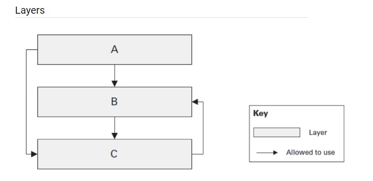

## Name examples of the layered architecture. Do they differ or just extend each other?
Examples:
1. N-Tier architecture
2. Clean architecture
3. Hexagonal architecture
Layered architectures are not mutually exclusive; they can coexist and be combined to suit the specific needs and complexities of an application. Each architecture emphasizes certain principles and patterns but ultimately aims to achieve similar goals of modularity, maintainability, and scalability.

## Is the below layered architecture correct and why? Is it possible from C to use B? from A to use C?

The architecture is mostly correct. There are three layers (A, B, and C) and A can use B, and B can use C. There is also a possibility for A to use C directly. This can be beneficial when there is no real business logic in B and A can bypass it. However, C should not be able to use B.

## Is DDD a type of layered architecture? What is Anemic model? Is it really an antipattern?

DDD (Domain-Driven Design) is not a type of layered architecture but a methodology for structuring complex software systems around the domain model. While layered architectures focus on organizing components into horizontal layers, DDD emphasizes the central role of the domain model, which encapsulates business logic and rules. An Anemic Model is a design anti-pattern where domain objects lack behavior and primarily contain data. This violates encapsulation and leads to procedural-style code. While useful in simple CRUD applications, it's considered an anti-pattern in DDD as it diminishes the effectiveness of domain modeling and violates principles like encapsulation and cohesion.

## What are architectural anti-patterns? Discuss at least three, think of any on your current or previous projects.

Architectural anti-patterns are design principles or practices that seem initially appealing but ultimately lead to suboptimal or problematic software architectures. Here are three common architectural anti-patterns:

    Big Ball of Mud: This anti-pattern describes a system with no clear architecture or structure, characterized by tangled dependencies, spaghetti code, and a lack of separation of concerns. It often arises due to incremental changes and neglect of architectural principles over time. In a previous project, we encountered a legacy system that had evolved into a big ball of mud, making it difficult to understand, maintain, and extend.

    God Object: Also known as a monolithic object or a mega-class, the God Object anti-pattern occurs when a single class or component becomes responsible for too many responsibilities or functionalities. This violates the Single Responsibility Principle and leads to tightly coupled and difficult-to-maintain code. In a current project, we refactored a God Object into smaller, more cohesive classes to improve modularity and maintainability.

    Golden Hammer: This anti-pattern refers to the tendency to overuse a familiar or popular technology or tool, even when it's not the best fit for the problem at hand. It results in unnecessary complexity, performance issues, and missed opportunities to leverage more appropriate solutions. In another project, we encountered a team overly reliant on a specific framework, leading to difficulties when requirements changed and the framework's limitations became apparent.

## What do Testability, Extensibility and Scalability NFRs mean. How would you ensure you reached them? Does Clean Architecture cover these NFRs?

Testability, extensibility, and scalability are Non-Functional Requirements (NFRs) that are crucial for the success of software systems:

    Testability: Testability refers to the ease with which a system or its components can be tested. It involves designing code in a way that facilitates automated testing, including unit tests, integration tests, and end-to-end tests. To ensure testability, you can follow practices such as writing modular and loosely coupled code, using dependency injection, and adhering to SOLID principles.

    Extensibility: Extensibility refers to the ease with which a system can be extended or modified to accommodate new requirements or features. It involves designing code that is flexible and allows for easy addition of new functionality without significant modification of existing code. To ensure extensibility, you can use design patterns such as Strategy, Decorator, and Factory, and follow principles like Open/Closed Principle and Dependency Inversion Principle.

    Scalability: Scalability refers to the ability of a system to handle increasing workload or user demands by adding resources or scaling horizontally. It involves designing architecture and code that can accommodate growth without compromising performance or reliability. To ensure scalability, you can design for distributed systems, use caching and load balancing techniques, and optimize database queries and data access.

Clean Architecture, with its emphasis on separation of concerns, dependency inversion, and encapsulation, inherently supports these NFRs. By separating concerns into layers and defining clear boundaries between them, Clean Architecture promotes testability, as each layer can be tested independently. Additionally, its focus on abstraction and loose coupling facilitates extensibility, allowing components to be easily replaced or extended. Moreover, Clean Architecture's emphasis on decoupling business logic from external frameworks and technologies supports scalability by enabling the system to scale horizontally and vertically as needed.